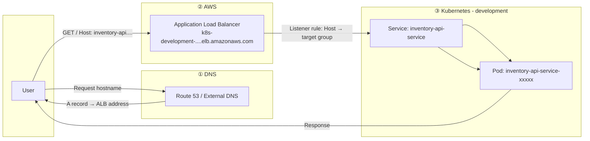
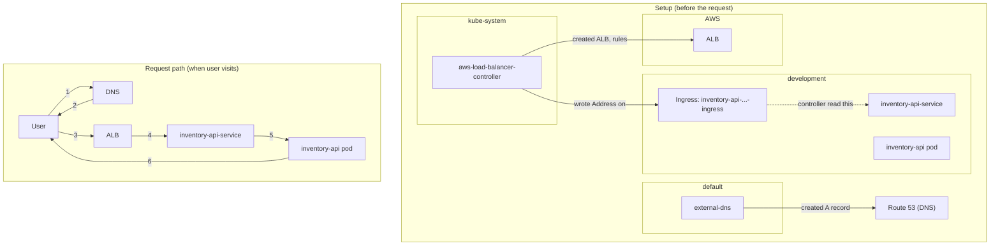

# End-to-End Path: One User Request Through Your EKS Setup

One path, one request — and every piece it touches, in order.

---

## The path (one diagram)

Example: user opens **https://inventory-api.533266955893.realhandsonlabs.net** in a browser.

---

## Step-by-step: what the user request touches

| Step | Where it lives | What happens |
|------|----------------|--------------|
| **① User** | — | User types or follows a link to `inventory-api.533266955893.realhandsonlabs.net`. |
| **② DNS** | AWS (Route 53) + **default** (external-dns pod) | Browser asks: “What IP/host is that domain?” Route 53 (or records created by **external-dns** in `default`) answers: “That hostname points to the ALB,” e.g. `k8s-development-eef0b51b5d-2138554603.us-east-1.elb.amazonaws.com`. |
| **③ ALB** | AWS (not in Kubernetes) | Browser sends the request to the ALB, with **Host: inventory-api.533266955893.realhandsonlabs.net**. The ALB has listener rules (created by the controller from your Ingress): “If Host = inventory-api.... → forward to the target group for **inventory-api-service** in **development**.” |
| **④ Target group → Service** | AWS → **development** | The ALB’s target group sends the request into the cluster to the **inventory-api-service** Service in the **development** namespace. |
| **⑤ Service → Pod** | **development** | The Service (in **development**) forwards to a healthy **inventory-api** pod in the same namespace. |
| **⑥ Pod** | **development** | The pod handles the request (e.g. talks to DynamoDB, other services) and returns the response. Response goes back: Pod → Service → ALB → User. |

So the **request path** is: **User → DNS → ALB → (target group) → Service (development) → Pod (development) → back to User.**

---

## How this path got set up (who touched what)

These pieces don’t handle the user’s request directly; they **configure** the path:

| Piece | Namespace | Role in the path |
|-------|-----------|-------------------|
| **AWS Load Balancer Controller** | **kube-system** | Watches **Ingress** in all namespaces (including **development**). For your 6 development Ingresses it created **one ALB**, added listener rules (Host → target group per service), and wrote the ALB address onto each Ingress (**Address** in `kubectl get ingresses`). So the controller is why the ALB exists and why “inventory-api...” goes to the right place. |
| **Ingress** (e.g. inventory-api-development-ingress) | **development** | Declares: “Host **inventory-api....** should go to **inventory-api-service**.” The controller read this and configured the ALB accordingly. The user’s request doesn’t “hit” the Ingress object; the ALB was already configured from it. |
| **External DNS** | **default** | Can create DNS records (e.g. in Route 53) so that hostnames like `inventory-api....realhandsonlabs.net` resolve to the Ingress **Address** (the ALB). So the user can use the friendly hostname instead of the ALB hostname. |

So **one end-to-end path for the user** is: **User → DNS (touched by external-dns) → ALB (created/managed by controller from Ingress) → Service → Pod**, with **Ingress** and **controller** being what built that path.

---

## One diagram with namespaces and “setup” vs “request”

**Summary:** The **request** path is User → DNS → ALB → Service (**development**) → Pod (**development**). The **controller** (kube-system), **Ingress** (development), and **external-dns** (default) are the pieces that set up that path so the user’s request can flow through it.
